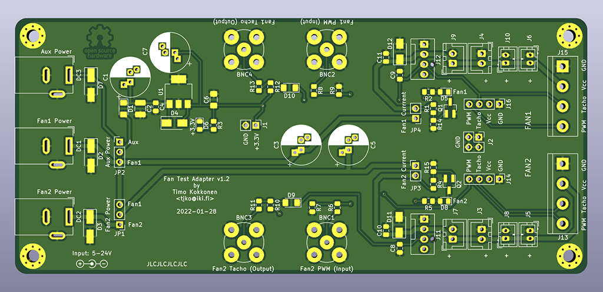
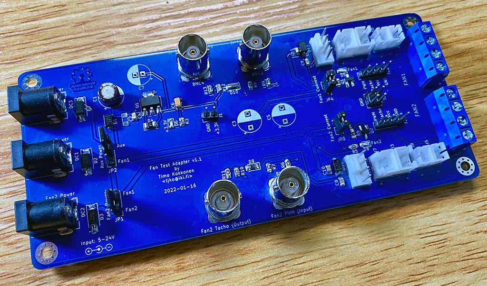
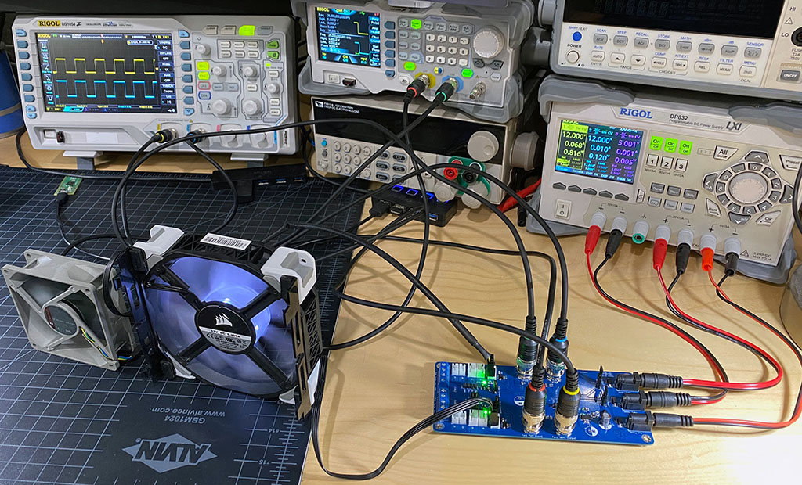

# fan-test-adapter
Adapter PCB board for easily testing PC (PWM) fans.

Adapter was created to simplify characterising PC fans. It's mainly meant for PWM fans, but can also be useful for 3-pin PC fans. Adapter also has common JST connectors for common 2-pin fans.
This adapter was used in development of [FanPico](https://github.com/tjko/fanpico/) to "emulate" motherboard FAN outputs.

Adapter is meant to be used with
* 3 channel programmable power supply (but will work fine with 1 or 2 channel PSUs)
* 2+ channel oscilloscope (or frequency counter)
* 2 channel signal generator

Assembled fan test adapter:

Fan test adapter in use:

## Usage Notes
This is only adapter for easily testing/controlling PWM fans. If used incorrectly it could easily damage your fans, etc...

### Power Connectors
Fan Test Adapter has three DC power jacks. It can be used only with power supplied to "Fan1 Power" jack, but it may be desirable to use all three, depending on how adapter is being used.

#### AUX Power
This is can be used to power the board itself (3.3V power rail, LEDs, etc). This can be useful if doing fan power consumption measurements via measuring supplied power to Fan1/Fan2 connectors.
When using this connector make sure jumper _Aux Power_ is set to _Aux_ position (and _Fan2 Power_ jumper is set to _Fan2_ position).

Recommended supply voltage is 5V (however up to 24V can be used if needed).

#### Fan1 Power
This is used to provide power to Fan1. Additionally _Aux Power_ jumper can be set to _Fan1_ position if _AUX Power_ is not used.

Recommended supply voltage is the nominal voltage of the fan being tested (Voltage should be in range from 5V to 24V max).

#### Fan2 Power
This is used to proive power fo Fan1.  If this connector is used remember to set _Fan2 Power_ jumper to _Fan2_ position.

Recommended supply voltage is the nominal voltage of the fan being tested (Voltage should be in range from 5V to 24V max).

### Jumpers

#### Fan1 Current
Normally closed. Can be used for precise current measurement of Fan1 power consumption, by removing the jumper and connecting current meter in the pins.
#### Fan2 Current
Normally closed. Can be used for precise current measurement of Fan2 power consumption, by removing the jumper and connecting current meter in the pins.
#### Aux Power
Jumper to select whether board itself (3.3V power rail) is powered from _Fan1 Power_ or _Aux Power_ power connector.
#### Fan2 Power
Jumper to select whether Fan2 is powered from _Fan1 Power_ or _Fan2 Power_ power connector.

### BNC Connectors
#### Fan1/Fan2 PWM (Input)
Input for PWM signal to control fan speed. Typically (with PC fans) this is 25kHz PWM signal (0-5V).

#### Fan1/Fan2 Tacho (Output)
Adapter generates 3.3V TTL signal from the open collector tachometer output of the fan. So this is generally safe to be read direcly with a 3.3V (or 5V) MCU.

## Building Notes
* See [PCB](#pcb-kerbers) section for how to get PCB manufactured (currently it is only few dollars pre PCB to have these manufactured).
* List of needed components can be found here: [BOM](fan-test-adapter-bom.csv)
* Some of the components are optional (but can offer some protection) for details see: [Schematic](fan-test-adapter.pdf)

### PCB (Kerbers)
Kerber files ready to be sent to a PCB maker (like JLCPCB, etc):
* [PCB Version 1.2](kerbers/fan-test-adapter-v1.2.zip)

